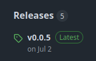

# Python Library
The following is a guideline on how to build a Python library. It is meant to be as complete and as beginner friendly as possible.
It goes over the initial repository setup on Github, followed by the suggested best practice. It then discusses the first release of the Python library, its maintenance and subsequent releases. I would invite the reader to refer to the Python library [Haarpy](https://github.com/polyquantique/haarpy) for an example of an library implementation based on the following tutorial.

The technicalities of git will not be discussed here. For a git tutorial, refer to `git.md`. The best practice in terms of Python working environments are also leftout of this tutorial. For a tutorial on Python working environment best practice in *Linux*, refer to `linux.md`.

## Table of Contents
- [Github Setup](#github-setup)
- [Best Practice](#best-practice)
    - [Working environment best practice](#working-environment-best-practice)
- [First Release](#first-release)
- [Maintenance](#maintenance)
    - [Badges](#badges)
- [Subsequent Releases](#subsequent-releases)
- [Documentation](#documentation)

## Github Setup
The first step is to create a new repository on Github. Three files are automatically included in the repo : `README.md`, `LICENSE` and `.gitignore` file. The `README.md` is a markdown file that contains the overview of the repo or the library; it is displayed on the main page of the repo. The `LICENSE` file is simply a copyright file. Finally, the `.gitignore` file is useful to ignore specific types of files from a git standpoint whenever modifications are pushed to a specific branch.

The `requirements.txt` file

The `__init__.py` file

## Best Practice
### Working environment best practice
Actual code files should be placed in a folder with the name of the library. That would be the *haarpy* folder in this example. The modules of the library can then be saved in this folder. A *tests* folder should also be created within this folder where a different test file shall be created for every module of the library. See for instance the `unitary.py` file saved within the *haarpy* folder and its test filed called `test_unitary.py` saved in the *tests* folder.

There are many ways to perform unit tests in Python. The most commun one is throught the *pytest* library that should be part of the developpement required libraries. The idea of the unit test is to validate the well functionning of the functions of eachmodule against known results or expected behavior. All test names shall be named `test_...` or else it will be ignored by the *pytest*. Good unitest should call every single line of the tested module, we then say that the coverage is of 100%. The tests can then be run through the terminal. For instance
```
pytest haarpy/tests/tests_unitary.py
```
will run the test of that specific test file. To run a specific test, one can do
```
pytest haarpy/tests/tests_unitary.py -k test_get_conjugacy_class
```
To other libraries are quite useful from a best practice standpoint : `black` will format the code to the PEP 8 standard, while `pylint` will analysis code statically and give it a score out of 10 with refactoring suggestions. Both should be run on modified modules before pushing to the repo. For instance,
```
black haarpy/unitary.py
pylint haarpy/unitary.py
```

### Coding best practice
Move **../clean_code.md** here.

## First release
**.github/workflows/python-publish.yml**

I can't recall the exact steps we did in terms of linking **Pypi** to the repo and building the wheel to make the library pip installable.

```
pip install haarpy
```
But it is preferable to install from source to always work from the version in developpement. To do so, you have to be in your clone folder.
```
pip install -e .
```
In order to also include all needed libraries in your local working environment.
```
pip install -r requirements.txt
pip install -r requirements-dev.txt
```
## Maintenance
The library is now pip installable. Now imagine you have added some features to the library. You created a new branch, made some changes, did a pull request 


The following section discuss the maintenance of the library and the procedure to update the library by releasing a new version.


Create a new branch make some changes. And do pull request. You can automate the test by...

log of changes
### Badges
The badges, usually provided by [Shields](https://shields.io/), are often seen on the main page of Python libraries repos. It provides concise information about the library and asserts its reliability.
<p align="center">
  
</p>

In this specific case, from the left to right, the badges : assert that all tests are passing and that the test coverage is of 100% (percentage of lines of code covered by the tests), and show the compatible Python versions and the library's latest version. In order to add the same badges to your project, the first thing you need to do is to add the following HTML code to your **README.md** file. You will of course need to update it to match your project. The token required for the code coverage badge will be explained later.
```
<div align="center">

  <a href="https://pypi.org/project/haarpy">
    
  </a>

  <a href="https://codecov.io/gh/polyquantique/haarpy" > 
    
  </a>

  <a href="https://pypi.org/project/haarpy">
    
  </a>

  <a href="https://pypi.python.org/pypi/haarpy">
    
  </a>

</div>

<br>
```
`href` is a the badges hyperlink while `src` is its source. The easiest badges to produce for the are generated on the fly but Shields using the metadata found on PyPI. Thus, those badges are updated automatically with each new release.

The test and coverage badges require a bit more work. The code coverage badge should be broken for now. A token has to be created for the repo. To do so, you must create an account on [Codecov](https://about.codecov.io/). Make sure the account is linked to the Github account of the owner of the repo in order to have proper permission You must then [install Codecov](https://about.codecov.io/) on your repository. Scroll to the bottom of the page, select **Open Source** and then click **Install it for free**. You can then select on which repository you whish to install Codecov. Then, from your account page, go to your repository and select **Settings** on the top right of the page. Copy the token under **Repository Upload Token**. You must then navigate to the Github repo page, go the the **Seetings** and select **Actions** under **Secrets and variables**. Create a **New repository secret** named *CODECOV_TOKEN* where you have pasted the token. Your repository now have a Codecov token.

The value of the shorter token to be replaced in the previous HTML code can be found by looking at the badge examples for your repository in the [Codecov app](https://app.codecov.io/login).

The next step is to write a workflow that will be lunched everytime a pull request is created in order to automtatically run the tests and update the code coverage. First, add a file **/.github/workflows/tests.yml** to the repo. Its content can be copied from Haarpy's [tests.yml](https://github.com/polyquantique/haarpy/tree/master/.github/workflows) file. Once again, the content of the file has to be updated according to your specific project. This file will automatically run all tests and update Codecov on every pull request, and every push made to the *master* branch.
## Subsequent Releases


The last thing to do is to update the version number everywhere on the repo the version of the new release. In order to avoid missing any instance, use the following shell command to find all files containing an instance of the string *version*.
```
grep -rl "version" .
```
I would usually validate that all files have been properly updated by looking for any instance of the old version number.
```
grep -rl "0.0.1" .
```
The library is now ready for its new release. Click on **Releases* on the right side of the main page of the repo.
<p align="center">
  
</p>

Then click on **draft a new release**. Select a tag for the release in the appropriate box. I usually name them with the convention **v0.0.2** with the appropriate release number. The release title would usually be the same as the tag. Finally, one can write a little release note before pressing **Publish release** and voilà, the new release is up and running. The *Pypi* link on the main page should now show the correct version. Note that the whole process can be automated as it is often the case for large librairies.

The installed library can then be updraged on your local environment with the pip command
```
pip install haarpy -upgrade
```
You can always see which version you are working with from a Python terminal.
```
python3
import haarpy
haarpy.__version__
haarpy.about()
```

## Documentation
### Generate documentation from docstrings
```
pip install sphinx
pip install sphinx_rtd_theme
mkdir docs
cd docs
sphinx-quickstart
sphinx-build -b html . _build
```
Add `docs/_build` to the *.gitignore* file.

### Host documentation on Read the Docs
